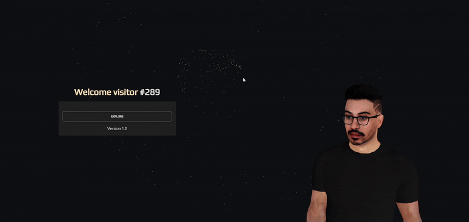

```php
$me = new SoftwareDeveloper();
```

I'm a passionate Software Developer dedicated to building innovative solutions and sharing knowledge with the tech community. Whether I'm coding, writing articles, or exploring new open source technologies, I strive to bring creativity and efficiency to every project. 



---

## 🌐 Connect with Me

- **LinkedIn:** [raziel-rodrigues](https://www.linkedin.com/in/raziel-rodrigues/)
- **Articles:** [Dev.to](https://dev.to/razielrodrigues)
- **Website:** [razielrodrigues.vercel.app](https://razielrodrigues.vercel.app/)

---

## 📊 GitHub Stats

<p align="left">
  
  
</p>

---

## 💼 Projects & Portfolio

I invite you to explore my portfolio where I showcase my latest projects, collaborations, and contributions to the software development community.  
Check it out on my [personal website](https://www.razielrodrigues.dev/).

---

*Thanks for visiting my profile! Feel free to reach out for collaborations, questions, or just to say hi.*
